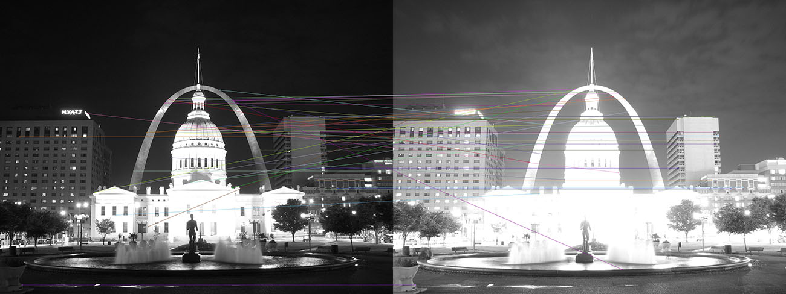
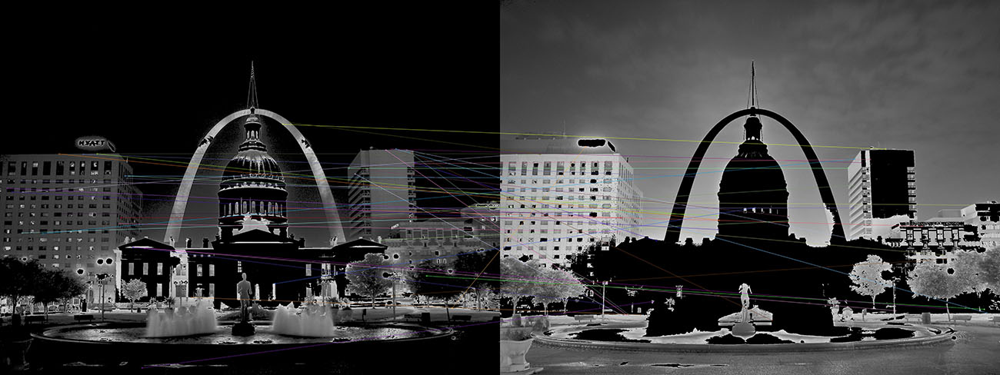
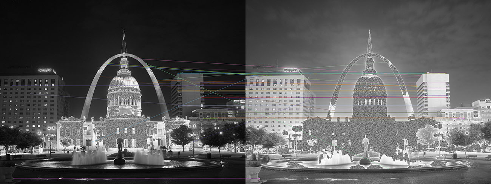

# Image Matching
At the beginning should all photos be readjusted so position of a pixel in all photos displaces same point of photos. to meet this need we use SIFT functions. 
a simpel approach leads a lot of unwanted matching.
 

  
I tried to replace all colors that are too light or to dark with a black color, so maybe SIFT would ignore this parts.

 The result ist not better if its not worse
  I tried to replace all unwanted values with a random value between 0 and 255 so it would be impossible for SIFT to 
find a pattern in this parts 
 

 result seems a bit better 